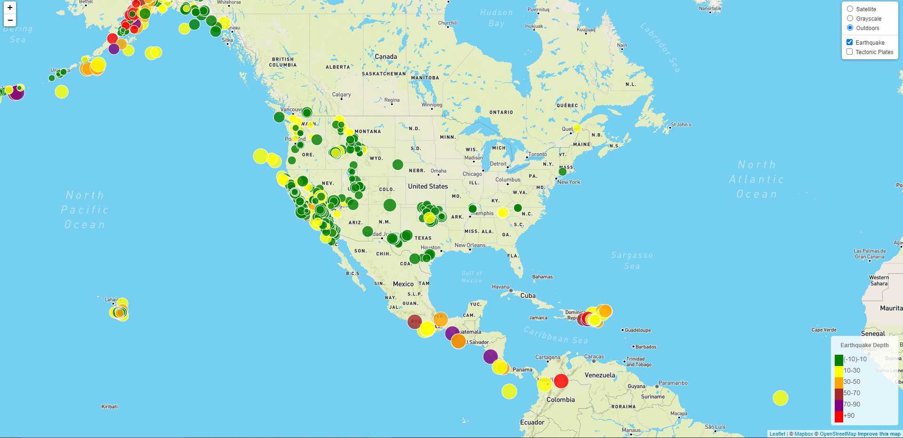

# Leaflet Geomaping

This Repo we created geomapping in multi layers using [mapbox](https://account.mapbox.com/).

We did visualize all Earthquakes in last 7 days using a JSON representation of that data using [USGS GeoJSON Feed](http://earthquake.usgs.gov/earthquakes/feed/v1.0/geojson.php).

* In the first folder `Leaflet-Step-1` we create a map using Leaflet Library in JS that plots all of the earthquakes from our data set based on their longitude and latitude.

*  Data `markers` reflect the `magnitude of the earthquake` by their `size` and and `depth` of the earth quake by `color`. Earthquakes with `higher magnitudes` appear `larger` and earthquakes with `greater depth` should appear `darker in color`.

* To create legend we import `choropleth.js` script.

* It include `popups` that provide information about the earthquake when a marker is clicked.

The visualization map look like that:

* In the second folder `Leaflet-Step-2` we create more data in the previous map by using `Tectonic plates` that found at at <https://github.com/fraxen/tectonicplates> in JSON file.

* After plot the data in polygone type, create legend for more basic layers and overlays.

### Gray scale layer using  `TileLayer.Grayscale.js` script: 

### Outdoors layer :

### Satlellite layer:

## Earthquakes with tectonic plates:

